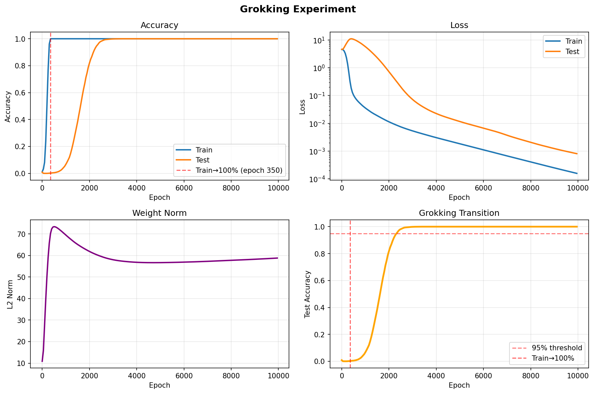
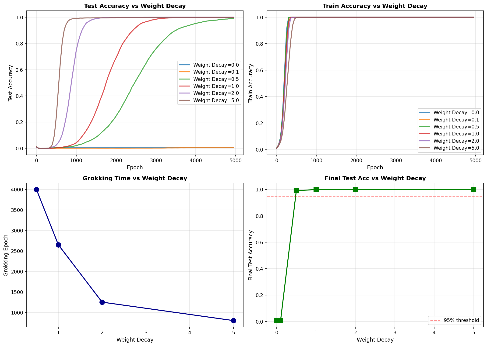
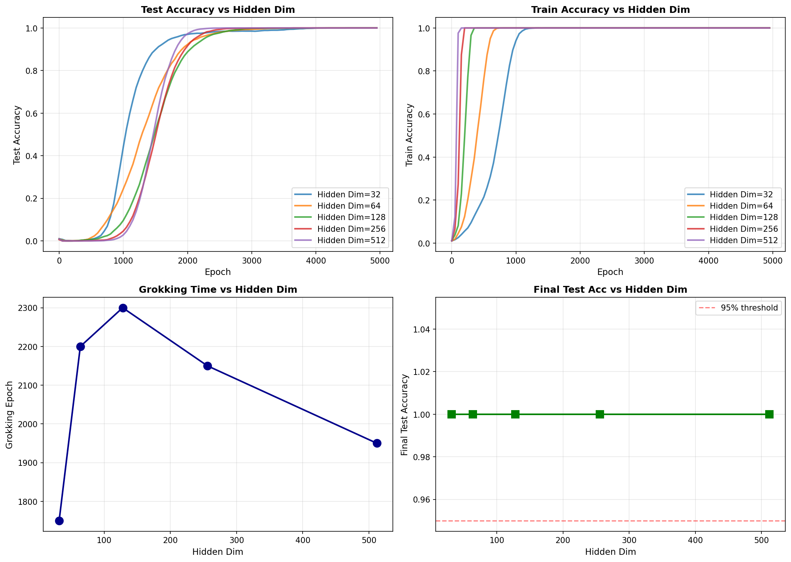
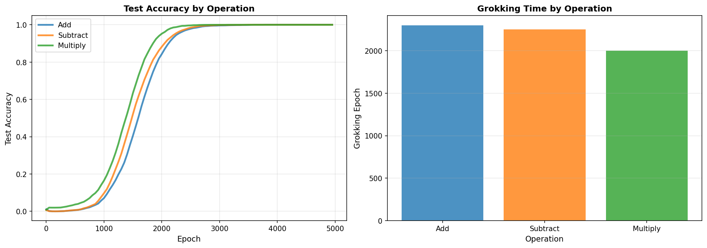
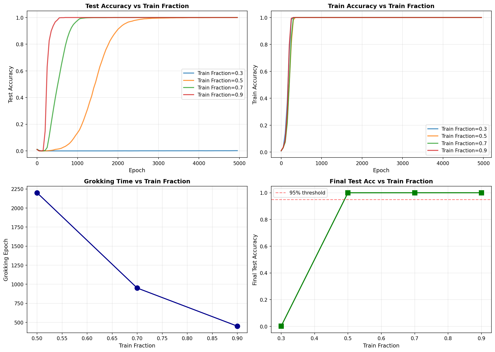

# Experiment and Analysis for Grokking in Neural Networks

**Author:** Ayush Chopra (ayushc@mit.edu), 1 January 2026

**Code:** github.com/AgentTorch/psi

---

## Experimental Setup and Design Choices

This experiment investigates the grokking phenomenon of delayed generalization in neural networks using modular arithmetic as the algorithmic task. We focus on modular addition, defined as f(a, b) = (a + b) mod 97, because it provides a clean, well-defined learning problem with a simple underlying rule and a finite input space.

The dataset consists of all 9,409 possible input pairs (a, b) where a, b ∈ {0, 1, ..., 96}. Each input pair is represented by concatenating two one-hot vectors, one encoding a and one encoding b, resulting in a 194-dimensional input vector. The target is a 97-class label corresponding to (a + b) mod 97. Unless otherwise noted, we use a 50/50 train-test split, which creates a deliberately challenging generalization setting. In this setting, the model can easily interpolate the training set but must discover the underlying rule in order to generalize.

Our model is a multilayer perceptron (MLP) with **two hidden layers**, using the architecture  194 → 128 → 128 → 97 with ReLU activations. This network has approximately 54,000 parameters and is intentionally overparameterized relative to the task complexity. Overparameterization facilitates memorization, which is necessary to observe the separation between early fitting and delayed generalization that characterizes grokking.

We train using the AdamW optimizer with learning rate 1e-3 and weight decay 1.0, optimizing cross-entropy loss. Because the dataset is small, we use **full-batch training**, which removes stochastic gradient noise and allows clearer measurement of learning dynamics and transition times. All models are trained for far more epochs than required to achieve perfect training accuracy—typically 5,000 to 10,000 epochs—so that delayed generalization can be observed if it occurs.

We log training and test accuracy, training and test loss, and the global L2 norm of the model parameters every 50 epochs. As a result, reported “overfitting” and “grokking” epochs correspond to the **first logged epoch** at which a threshold is crossed, with a temporal resolution of 50 epochs.

Unless otherwise stated, experiments are run with a fixed random seed (seed = 42) to enable controlled comparisons across hyperparameter sweeps. Where relevant, we note that additional seeds would be required to quantify variability in grokking times.

---

## Baseline Experiment: Evidence of Grokking

Our baseline experiment demonstrates clear grokking behavior on modular addition. The model reaches near-perfect training accuracy (≥99%) by approximately epoch 350, indicating that it has successfully fit the training set. At this point, test accuracy remains near chance level (≈1% for a 97-class problem), showing no evidence of generalization. This memorization regime persists for nearly 2,000 additional epochs.

Around epoch 2,300, test accuracy undergoes a sharp transition, rapidly increasing from near-zero to above 95% and quickly converging to 100%. This sudden improvement in generalization occurs long after the model has already achieved perfect training accuracy and is the defining signature of grokking.

To quantify this behavior, we define two milestones: the **overfitting epoch**, defined as the first logged epoch at which training accuracy exceeds 99%, and the **grokking epoch**, defined as the first logged epoch at which test accuracy exceeds 95%. The difference between these two quantities measures the delay between memorization and generalization. In the baseline configuration, the overfitting epoch occurs at approximately epoch 350, while the grokking epoch occurs at approximately epoch 2,300, yielding a grokking delay of roughly 1,900 epochs. Because metrics are logged every 50 epochs, these values are measured at a resolution of 50 epochs.

Weight norm dynamics provide additional insight into the learning process. During the early phase of training, the global L2 norm of the model parameters increases rapidly as the network constructs a high-capacity solution sufficient to memorize the training data. During the prolonged delay between overfitting and grokking, the weight norm gradually decreases under the influence of weight decay, despite training loss remaining near zero. Once grokking occurs, the weight norm stabilizes at a lower value, consistent with the emergence of a simpler, more structured solution that supports both perfect training accuracy and strong generalization.

By the end of training, the model achieves 100% training accuracy and 100% test accuracy. The extended delay between fitting and generalization, the abrupt transition in test accuracy, and the accompanying change in weight norm dynamics together provide strong evidence of grokking in this setting.

*Figure 1: Baseline experiment showing grokking on modular addition. Training accuracy reaches near-perfect levels early, while test accuracy remains near chance for an extended period before undergoing a sharp transition to perfect generalization. Loss curves (log scale) and weight norm dynamics illustrate qualitatively distinct learning regimes corresponding to early memorization, a prolonged transition period, and eventual grokking. Metrics are logged every 50 epochs.*

---

## Sensitivity Analysis
Having established clear grokking behavior in the baseline configuration, we next examine how this phenomenon depends on key properties of the training setup. Specifically, we extend the baseline experiment by systematically varying four factors: the strength of explicit regularization (weight decay), model capacity (hidden layer width), the underlying arithmetic operation being learned, and the amount of training data available. For each axis, we measure how changes in these parameters affect the emergence, timing, and robustness of grokking, using the same operational definitions of overfitting and grokking epochs introduced above. This analysis allows us to identify which ingredients are necessary for grokking to occur in this setting and which primarily modulate the speed of the transition from memorization to generalization.

### 1. Weight Decay: Dependence of Grokking on Explicit Regularization

To examine how explicit regularization affects grokking, we varied the weight decay coefficient across the set {0.0, 0.1, 0.5, 1.0, 2.0, 5.0}, while holding all other hyperparameters fixed (128 hidden units, **up to 5,000 training epochs**). This sweep reveals a strong dependence of grokking behavior on the strength of weight decay in this setting.

For weak or absent regularization (weight decay = 0.0 or 0.1), the model reliably achieves perfect training accuracy by approximately epoch 300 but fails to generalize: test accuracy remains near chance level (≈1%) throughout the full **5,000-epoch training horizon**. In these cases, no grokking transition is observed within the allotted training time.

A qualitative change emerges at weight decay = 0.5, where grokking first appears, albeit after a long delay: the grokking epoch occurs at approximately epoch 4,000, corresponding to a delay of roughly 3,700 epochs after overfitting. As weight decay is increased further, the onset of grokking accelerates substantially. With weight decay = 1.0, grokking occurs around epoch 2,650; at 2.0, around epoch 1,250; and at 5.0, as early as epoch 800. Across this range, increasing weight decay produces an approximately monotonic reduction in grokking time, corresponding to a more than five-fold decrease from the weakest regularization level at which grokking is observed.

These results indicate that, in this experimental regime and within the **5,000-epoch training budget** considered, sufficiently strong weight decay is required for grokking to occur. Moreover, once above this threshold, stronger regularization substantially reduces the time required for the model to transition from memorization to generalization. While this sweep does not establish a causal mechanism, it suggests that explicit regularization plays a central role in destabilizing high-complexity memorization solutions and enabling the eventual emergence of a generalizable algorithmic solution.

*Figure 2: Weight decay sensitivity analysis. For weak regularization (WD < 0.5), no grokking transition is observed within the 5,000-epoch training horizon. Above this threshold, increasing weight decay substantially accelerates grokking, with the grokking epoch decreasing from approximately 4,000 epochs (WD = 0.5) to approximately 800 epochs (WD = 5.0).*

---

### 2. Model Size: Capacity Affects Memorization More Than Grokking Time

To study how model capacity influences grokking dynamics, we varied the width of the hidden layers while keeping all other hyperparameters fixed (weight decay = 1.0, 50% training data, up to 5,000 epochs). Hidden layer sizes ranged from 32 to 512 units, corresponding to models with approximately 10,000 to 412,000 parameters—a more than 40-fold increase in capacity.

All model sizes eventually achieved perfect generalization within the training horizon, indicating that grokking is robust across a wide range of network capacities in this setting. However, the timing of grokking exhibits a more nuanced dependence on model size. The smallest model (32 hidden units) groks earliest, reaching the grokking threshold at approximately epoch 1,750. As model size increases to 64 and 128 hidden units, grokking occurs later, around epochs 2,200 and 2,300 respectively. For larger models (256 and 512 hidden units), grokking occurs slightly earlier again, at approximately epochs 2,150 and 1,950.

While the grokking epoch varies modestly across model sizes, the overfitting epoch changes dramatically. Larger models reach perfect training accuracy much earlier: the 512-unit model overfits by approximately epoch 150, whereas the 32-unit model overfits only around epoch 1,150. As a result, the delay between memorization and generalization increases substantially with model size, even though the absolute time to grokking remains on a similar scale.

These results suggest that increasing model capacity primarily accelerates memorization rather than accelerating the discovery of the underlying algorithmic rule. Larger models quickly find high-capacity solutions that fit the training data, but the transition to a generalizable solution occurs on a comparatively stable timescale. The slightly earlier grokking observed for the smallest model may reflect limited memorization capacity, which forces the network to adopt a more structured solution sooner. The modest recovery in grokking speed for the largest models suggests that strong regularization can still guide high-capacity networks toward simple solutions, though this effect is weaker than the impact of model size on memorization.

Because these differences in grokking time are on the order of a few hundred epochs and measurements are logged at a 50-epoch resolution, additional runs with multiple random seeds would be required to establish the statistical significance of the observed non-monotonic trend. Nevertheless, the dominant and robust effect of model size in this experiment is its influence on the speed of memorization rather than on the absolute timing of grokking.

*Figure 3: Model size sensitivity analysis. All model sizes eventually exhibit grokking and achieve perfect test accuracy. Smaller models overfit later and, in this setting, reach the grokking threshold earlier, while larger models overfit rapidly but generalize on a similar overall timescale. The dependence of grokking time on model size is non-monotonic, with variations on the order of a few hundred epochs.*
---

### 3. Operations: Grokking Across Modular Arithmetic Tasks

To assess whether grokking is specific to modular addition or extends to other algorithmic tasks, we repeated the baseline experiment using three modular arithmetic operations: addition, subtraction, and multiplication (all mod 97), while keeping the model architecture, optimizer, regularization strength, and training procedure fixed.

All three operations exhibit clear grokking behavior. In each case, the model first achieves perfect training accuracy while test accuracy remains near chance, followed by a delayed and rapid transition to near-perfect test accuracy. The timing of this transition is broadly similar across operations. Addition and subtraction grok at approximately epochs 2,250–2,300, while multiplication groks slightly earlier at approximately epoch 2,000. Despite these modest differences, all three tasks converge to perfect final test accuracy within the training horizon.

These results indicate that the grokking phenomenon observed in this setup is not specific to learning modular addition, but also appears in closely related modular arithmetic tasks under the same regularization and training conditions. The small variation in grokking time across operations suggests that task structure may influence the speed of the transition, but does not fundamentally alter the qualitative learning dynamics.

*Figure 4: Grokking across different modular arithmetic operations. Addition, subtraction, and multiplication all exhibit delayed generalization followed by a rapid transition to perfect test accuracy. Grokking occurs on similar timescales across operations, with modest variation in the timing of the transition.*

---

### 4. Training Data Size: Threshold Behavior in Grokking

To examine how data availability influences grokking, we varied the fraction of all possible input pairs used for training, considering training splits of 30%, 50%, 70%, and 90%, while keeping the model architecture, optimizer, and regularization strength fixed (weight decay = 1.0). This sweep reveals a sharp dependence of grokking behavior on the amount of training data.

With only 30% of the data (2,822 training examples), the model achieves perfect training accuracy but fails to generalize: test accuracy remains near chance level (≈0.2%) throughout the full 5,000-epoch training horizon. This failure to grok occurs despite the use of strong regularization, indicating that explicit regularization alone is not sufficient to induce generalization when data coverage is too limited.

At 50% data coverage (4,704 training examples), grokking first emerges, with the grokking epoch occurring at approximately epoch 2,200. As the training fraction increases further, grokking accelerates substantially: at 70% data, grokking occurs around epoch 950, and at 90% data, around epoch 450. This corresponds to nearly a five-fold reduction in grokking time between the smallest data fraction at which grokking is observed and near-complete data coverage.

These results suggest the presence of a data threshold for grokking in this setting. Below this threshold, the model can memorize the training set but lacks sufficient coverage to infer the underlying algorithmic structure. Above it, additional data progressively reduces the time required for the model to transition from memorization to generalization. Together, these findings highlight that grokking depends not only on model capacity and regularization, but also critically on the availability of informative training data.

*Figure 5: Training data size sensitivity analysis. With 30% of the data, no grokking transition is observed within the 5,000-epoch training horizon despite strong regularization. Above this threshold, increasing the training fraction substantially accelerates grokking, with higher data coverage leading to earlier transitions and perfect final test accuracy.*
---

## Hypothesis on Grokking Dynamics

Based on our experimental results, we hypothesize that grokking in this setting arises from the interaction of three factors: overparameterization, explicit regularization, and sufficient training data coverage. In our experiments, all three appear jointly required for delayed generalization to emerge within the training horizon considered.

Empirically, training dynamics exhibit three qualitatively distinct regimes. In an initial **memorization regime**, the model rapidly achieves perfect training accuracy while test accuracy remains near chance, consistent with the existence of a high-capacity solution that fits the training data without capturing the underlying rule. This phase is characterized by rapid growth in parameter norms. Following this, a prolonged **transition regime** is observed in which training loss remains low and training accuracy is saturated, yet test accuracy does not improve. During this period, parameter norms gradually decrease under the influence of weight decay, indicating a slow reorganization of the learned solution despite no apparent change in training performance. Finally, a **grokking regime** emerges in which test accuracy undergoes a rapid transition to near-perfect performance while training accuracy remains unchanged.

These observations are consistent with interpretations of grokking proposed in prior work, in which learning dynamics involve competition between multiple solutions that fit the training data but differ in complexity and generalization. In this view, gradient-based optimization initially favors solutions that are easier to fit—such as memorization-based representations—while explicit regularization and continued training gradually bias the model toward simpler, more structured solutions that generalize. Our width and data-fraction sweeps support this interpretation indirectly: increasing model capacity accelerates memorization without proportionally accelerating grokking, while insufficient data prevents grokking from occurring even under strong regularization.

Importantly, while weight norm dynamics and sensitivity analyses support this hypothesis, we do not directly measure internal representations or competing circuits in this work. As such, the proposed explanation should be viewed as a coherent, testable interpretation of the observed learning dynamics rather than a definitive mechanistic account. Future work could probe this hypothesis more directly through representation analysis, linear probing, or targeted ablations designed to isolate competing solution pathways.
